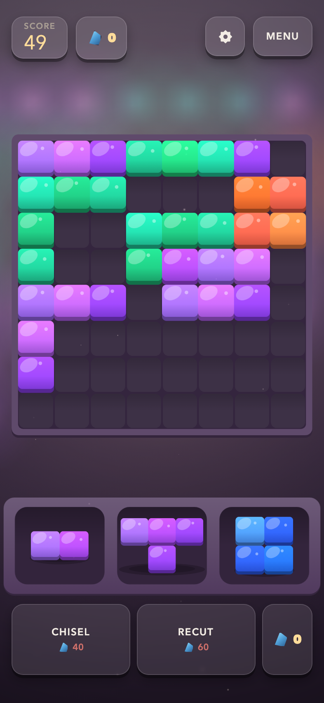
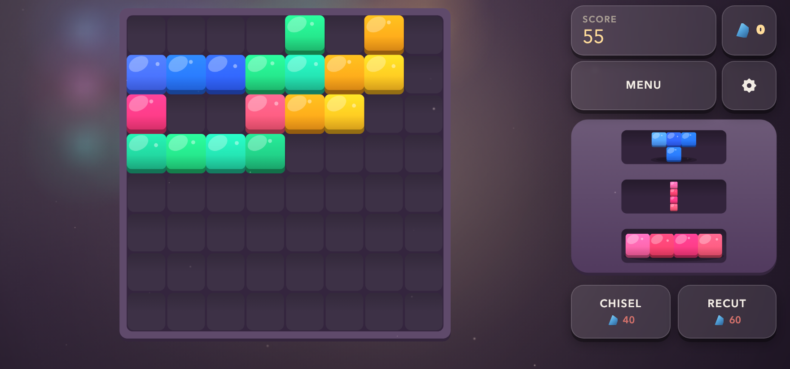

# LEADLIGHT

A single-thumb block puzzle for RUN.world. Three cut pieces wait in a tray; you
drag them onto an 8×8 panel. Fill a row or a column and the kiln fires it — the
glass lights, cracks, and falls away as shards.

<p align="center">
  
</p>

Portrait and landscape are both first-class, and it rescales for desktop rather
than rendering a phone game at monitor size:

<p align="center">
  
</p>

PixiJS 8, WebGPU-first with an automatic WebGL fallback. React owns the shell;
Pixi owns the bench. Every texture, every backdrop, the store tile, and every
sound is generated by the game's own code — **no image, font, or audio file
ships**. The screenshots above are captured from the running game by
`npm run screenshots`, so they cannot show art the game no longer has.

**[`DESIGN.md`](DESIGN.md) is canon.** Every number the game uses for rules,
scoring, economy, or monetization is defined there first and implemented from
there. If the code and that document disagree, the document is the bug report.

## Status

Ship-track, not yet deployed. `gameId` in `src/config/platform.ts` and
`game.config.prod.json` is still the `rundot init` placeholder, so the Shop and
ad surfaces fail closed until it is provisioned. Everything else — the catalog,
the entitlement mapping, the LiveOps flags, the prices — is final and ships with
the build.

## Running it

```bash
npm run dev            # http://localhost:5187
npm run dev:playground # opt-in RUN Playground (real, persistent purchases)
```

Development query parameters:

| Query | Effect |
| --- | --- |
| `?screen=<id>` | Jump straight to `main`, `atelier`, `daily-rewards`, `daily-quests`, `stats`, `settings`, or `game` |
| `?debug=1` | Development diagnostics panel |
| `?qa=1` | Install the `__gameQa` browser contract used by `visual-qa.mjs` |
| `?renderer=webgpu\|webgl` | Force a backend, strictly — an unexpected error is a failure |

## Verifying it

```bash
npm run check       # format, lint, tests, public audit, both production builds
npm run simulate    # the rules, the arithmetic, and the bag, headless
npm run balance     # score distribution + the shard-economy guardrail
npm run visual-qa   # four viewports, real drags, audio and lifecycle gates
npm run thumbnail   # re-render public/thumbnail.jpg from the game's own art
npm run screenshots # re-capture the README images from the running game
```

`npm run simulate` is the only thing that can catch a scoring or draw bug: a
wrong score still looks like a plausible score on screen, and a bag that quietly
hands out dead trays just feels like bad luck. `src/game/puzzle/` imports
nothing from Pixi, React, or the store, so the rules it proves are the rules
that run.

`npm run balance` additionally asserts the economy guardrail from DESIGN.md
§5.1: a Recut must return fewer shards than it costs. If that ever inverts, a
banked player could play forever and the score ceiling would be set by patience
instead of skill.

## Layout

```
src/game/puzzle/    the rules — board, cut set, bag, scoring, run machine.
                    Renderer-free. This is what `npm run simulate` runs.
src/game/art/       every drawing function, as Canvas2D. The Pixi textures, the
                    Atelier swatches, the menu backdrop and the 512x512 store
                    tile all call these, so they cannot drift apart.
src/game/scene/     the bench: layout, the panel/tray scene, firing choreography.
src/game/           the React-to-Pixi boundary and the run controller that owns
                    the consequences (shards, ads, analytics, save).
src/systems/        save, palettes, commerce, ads, monetization, daily systems.
src/ui/             the React shell: menu, HUD, run cards, Atelier, settings.
```

Two boundaries are load-bearing:

- **`PuzzleRun` owns legality; `PanelScene` owns presentation.** The scene never
  decides whether a move is legal — it asks. That is why the board you see and
  the board the simulation proves are the same board.
- **Ownership is never read from the save.** Which palettes were *bought* comes
  from RUN Entitlements every session. The save only remembers which palettes
  were *earned* with shards, and which one is selected.

## Notes for anyone changing this

- Never add `Math.random()` to game logic; use `src/game/noiseRandom.ts`. Web
  Crypto is for security identifiers (purchase idempotency keys) only.
  `npm run test` enforces this.
- All renderer creation and teardown goes through
  `src/rendering/rendererLifecycle.ts`. Do not call `Application.destroy()`
  anywhere else.
- Canvas type is sized in design units, and one design unit is about 0.55 CSS
  pixels on a phone. Multiply the intended CSS size by **1.83** before it
  becomes a `fontSize` — see `typeSize()` in `src/game/scene/vfx.ts`.
- A tween can outlive the node it was created for: the ResizeObserver rebuilds
  the tray immediately after mount. Guard with `node.destroyed`.
- **The landscape rail is two mirrors of the same numbers.** `layout.ts` reserves
  design units for the DOM clusters (`HUD_RESERVE_LANDSCAPE`,
  `HELPER_RESERVE_LANDSCAPE`, `RAIL_WIDTH_LANDSCAPE`) and `app.css` restates them
  as `calc(<n> * var(--u))`. Change one, change the other: those reserves are the
  only thing keeping the React rail off the tray. Each cluster is pinned to an
  explicit height rather than sized by its content, because a bar that outgrows
  its reserve climbs over the plank.
- **On desktop, cap the SCALE, never the frame.** `stage.ts` caps `MAX_UNIT_PX`
  and `layout.ts` composes inside a centred `contentBox()`. The canvas paints the
  stage, so capping `#app-frame` instead leaves dark bands above and below it.
- **Safe-area insets have to be re-read from the SOURCE, not on resize.** A host
  publishes new insets after the resize it also fires, so a resize-only refresh
  keeps the outgoing orientation's numbers while CSS already has the new ones —
  and the scene and the DOM then lay out against different bottoms. `App.tsx`
  watches `documentElement` with a MutationObserver and resyncs the scene in the
  same frame; `applyRunSafeArea` skips unchanged writes so it cannot wake its own
  observer forever.
- `npm run test` also checks that every shop and entitlement id in
  `src/config/platform.ts` still exists in `rundot/shop.config.json`, and that
  every placement and product is enabled in `rundot/liveops.config.json`. Those
  files fail closed, so a missing entry means a permanently dark surface rather
  than an error.
